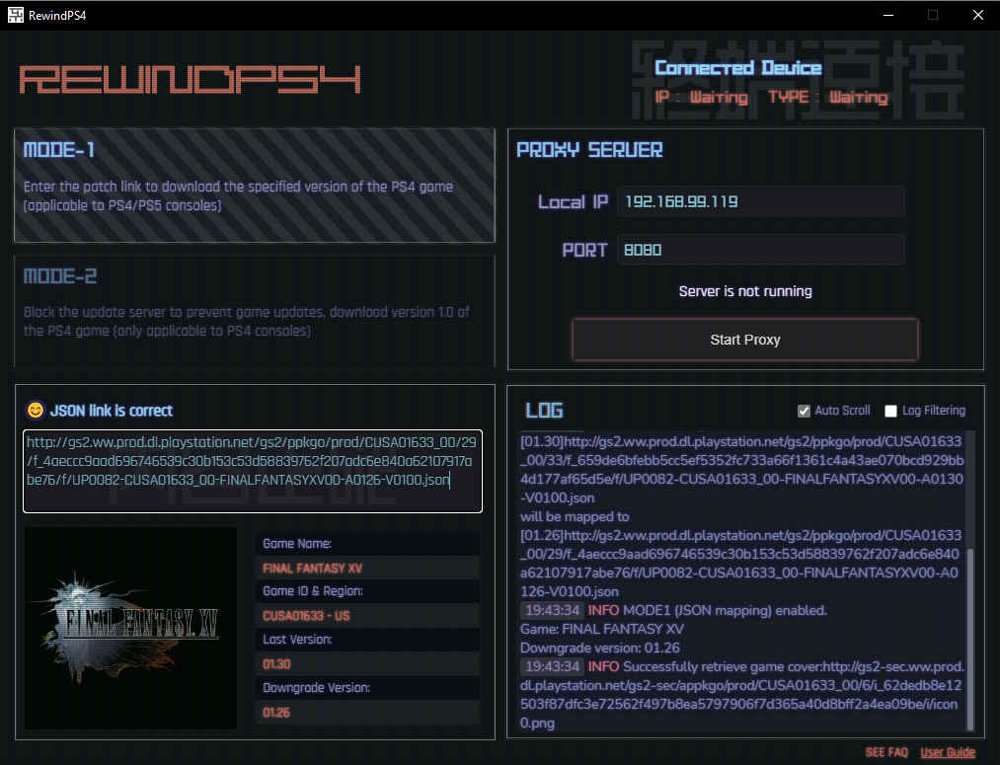

# RewindPS4

## Introduction

This tool creates a proxy server that allows your PS console to connect and download specific versions of PS4 games, effectively enabling game downgrading. Due to game updates, some content may change over time. This tool allows you to play older versions of games.

<a href="https://github.com/Ailyth99/RewindPS4/blob/main/build/screenshot.png" title="sss"></a>


#### Important Notes

1. This program works for downloading PS4 games on both PS4 and PS5 consoles. It does **NOT** work for PS5 games.
2. This program is **NOT** a jailbreak method. You do not need to modify your console in any way.

## Guide

[Complete Guide](https://foggy-bath-a54.notion.site/RewindPS4-Guide1-0-ENGLISH-28164b6f656d445f823a0f7c7d9ae890?pvs=4)


## Run code
This tool is built with a Go backend and a modern GUI powered by Wails and React. You'll need to have [Wails installed](https://wails.io/docs/gettingstarted/installation) beforehand, along with some frontend dependencies.
```
npm install --save baffle
npm install i18next react-i18next i18next-browser-languagedetector
```

run this tool,'cd' command to go into the main folder,input:
```
wails dev
```

Compile to exe:
```
wails build -clean -o yourexename.exe

```
You can find it in the 'build/bin' directory.

## Credits
*  [Goproxy](https://github.com/elazarl/goproxy)
*  [Wails](wails.io)
*  [Baffle](https://github.com/camwiegert/baffle)

##### Font
* SYN Nova Regular
* Nihonbashi 2.0 alphabet
* 造字工房尚黑细体
* 東亜重工フォント(Custom)


## Old version
[Previous versions](https://github.com/Ailyth99/RewindPS4/tree/python) were written in Python, making them easily runnable on macOS or Linux.


